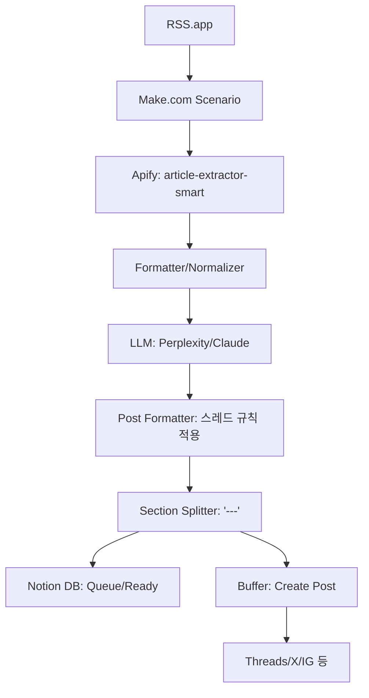

# Make AI Thread Uploader — Devlog **v1.0**
_2025-08-27 · Tags: AI-News-Pipeline, Make.com, RSS.app, Apify, Perplexity, Claude, Notion, Buffer_

---

## 🔥🔥🔥
**목표**: AI 뉴스 스레드를 자동 생성·업로드하는 파이프라인을 만들었다.  
**설계**: RSS.app → **Apify**(기사 추출) → LLM(Perplexity/Claude 요약·한글화) → 포맷터(스레드 규칙 적용) → `---` 분리(본문/댓글) → **Notion** 저장 → Buffer 예약 업로드.  
**결과 요약**: 동작은 했으나, 실운영에서 **Apify 적용 난이도/안정성 이슈**와 **Notion의 실용성 부족**이 드러남. 다음 버전에서 경량화 예정(v1.1).

---

## 왜 이렇게 설계했나(이유)
- **정확성**: RSS의 요약은 불안정 → **Apify**로 본문/이미지 정제해 LLM 입력 품질을 올리려는 의도.
- **운영성**: 스레드 규칙(Hook→맥락→불릿≥1→질문)과 `---` 댓글 분리를 **LLM**이 일관되게 생성.
- **기록성**: 업로드 전 상태를 **Notion**에 적재해 큐(Ready/Posted) 관리하려는 의도.
- **배포성**: **Buffer**로 다채널 예약·게시.

---

## 무엇을 만들었나(단계: Planner → Executor → Reviewer)

### 1) Planner
- **요구사항**
  - 150~280자, 존댓말, 불릿 ≥1, 마지막에 질문/CTA.
  - 댓글용 추가 설명은 `---` 아래로 분리.
  - 이미지 1~4장(중복/로고/배지 제외).
- **성공 기준(KPI)**
  - 실패율 < 5% (모듈 에러 기준)
  - 본문 길이 규칙 준수율 95%+
  - 중복 포스팅 0건(해시/DB로 차단)

### 2) Executor (모듈 사양)



#### RSS.app (Trigger)
- Fields: `title`, `url`, `published_at`, `content_html?`, `summary?`
- **중복 방지(초기안)**: Notion에서 `url` 존재 여부 조회 → 중단

#### Apify (Run an Actor: `article-extractor-smart`)
- Input JSON(권장):
```json
{
  "articleUrls": ["{{1.url}}"],
  "maxItems": 1,
  "proxyConfiguration": { "useApifyProxy": true }
}
```
- Output: `text`, `html`, `images[]`, `meta(og:image, ... )`

#### Image Parse (Regex + Aggregator)
- 1순위: `images[]` (Apify)
- 2순위: `html`에서 추출(최대 4장, 중복/로고/광고 제외)
```regex
]+src=["'](https?:\/\/[^"']+\.(?:jpg|jpeg|png|gif|webp))["']
```
- 백업: `og:image` 메타 추출
- 결과: `images[]`(≤4), `thumbnail = images[0]`

#### LLM 요약/포맷 (Perplexity/Claude)
- 입력: `title`, `url`, `published_at`, `clean_text`, `images[0..3]`
- 규칙(요약):  
  1) Hook(질문/감탄)  
  2) 핵심 맥락(1~2문장, 존댓말)  
  3) 불릿 ≥1(📌 또는 -)  
  4) 마지막 질문/CTA  
  5) 댓글용 내용은 `---` 아래 작성

#### Split
- `---` 문자열 기준 → `post_text`, `comment_text|null`

#### Notion (Create Page)
- 필드: `Name=title`, `Source=url`, `Post`, `Comment`, `Images`, `Status=Ready`, `Channel=Threads`

#### Buffer (Create Post)
- 본문: `post_text`
- 이미지: 대표 1장 기본(가능 채널만 최대 4장 시도)
- 예약: `published_at` 또는 사용자 지정
- 스레드 댓글: 모듈에 `start thread` 없음 → **수동 댓글**

---

### 3) Reviewer (이슈/교훈)

#### Apify 사용 한계(적용 난항의 실제 원인)
- `maxItems: 1` 조합에서 **빈 결과**가 간헐적으로 발생.
- `Run an Actor` vs `Run a Task` **혼용 시 입력 스키마 차이**로 실패.
- `startUrls`와 `articleUrls` 필드 **혼동**, 사이트별 호환성 편차.
- 일부 출처는 **차단/리다이렉트**로 본문·이미지 추출 불안정.
- 결과적으로 **운영 안정성 저하 + 복잡도 증가**, 디버깅 비용 과다.

#### Notion 필요성 저하(느끼지 못한 이유)
- 실무 플로우상 **즉시 업로드**가 주 → 큐 관리 이점이 제한적.
- 상태 동기화(Ready/Posted)보다 **Make 내부 변수/해시**가 더 단순·직접적.
- Notion을 쓰면 작성/조회/동기화 **왕복 비용**이 늘어남(오버헤드).

#### 기타 운영 이슈
- **Buffer 멀티 이미지 제한**: 채널·모듈 제약으로 **1장 폴백** 필요.
- **길이/중복 에러(400)**: 280자 컷, 중복 해시로 해결.
- **정규식 매핑 혼선**: `Matches[*].Groups[1]` + Iterator/Aggregator 순서 고정 필요.

---

## 체크리스트
- [ ] RSS 아이템 `url` 기준 중복 차단
- [ ] Apify 결과 존재(`text|html|images` 중 하나 이상)
- [ ] 이미지 1장 이상 or 안전 폴백(og:image)
- [ ] 150~280자/불릿≥1/질문형 마무리 규칙 충족
- [ ] `---` 분리 동작 확인
- [ ] Buffer 응답 2xx, 중복·길이 초과 없음

---

## 다음 액션(→ v1.1 방향성)
1. **Apify 제거 검토**: 실패 지점 다수 → **HTTP GET + Regex**로 경량화.  
2. **상태저장 단순화**: Notion 대신 **Make Data Store**로 `url_hash`, `posted_at` 관리.  
3. 이미지 파싱 **휴리스틱 강화**: `logo|icon|sprite|badge|ads` 제외, webp 지원.  
4. Buffer 멀티이미지 실패 시 **대표 1장 폴백**을 표준화.  
5. LLM 프롬프트를 `prompts/thread_writer_v3.md`로 분리(재현성↑).

---

## 커밋 로그(예시 · Conventional Commits)
- `docs: add devlog v1.0 with Apify/Notion architecture`
- `feat(buffer): support single-image fallback for multi-image failure`
- `refactor(regex): add webp and logo/ad filters`
- `chore: add prompt file stub (thread_writer_v3.md)`

---

## 부록
### A) 스레드 프롬프트 규칙(요약)
- Hook(질문/감탄) → 핵심 맥락 1~2문장(존댓말) → 불릿 ≥1 → 질문/CTA → `---` 아래 댓글용 추가.

### B) 예시 정규식
```regex
]+src=["'](https?:\/\/[^"']+\.(?:jpg|jpeg|png|gif|webp))["']
<meta[^>]+property=["']og:image["'][^>]*content=["'](https?:\/\/[^"']+)["']
```

---

## 변경이력(Changelog)
- **2025-08-27 · v1.0** — 초기 설계/구현 기록(Apify·Notion 포함), 운영 중 한계 파악. 다음 버전에서 경량화 예정.
