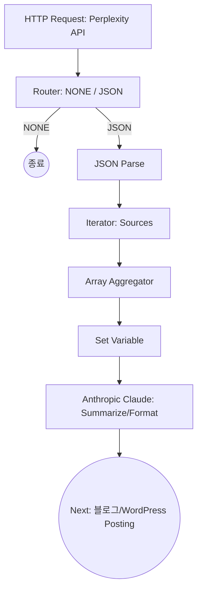

# 📝 Make AI 블로그·티스토리 자동화 제작 일지

## 1. 개요
- 목적: AI 뉴스 자동화된 요약 → 블로그/티스토리 포스팅  
- 도구: Make (Integromat), Perplexity API, Anthropic Claude, GitHub  
- 상태: 티스토리/네이버 블로그 API 종료로 **자동 포스팅 불가**, 워드프레스를 중심으로 전환 고려  

---

## 2. 제작 플로우 (현재 진행 상태)

---

## 3. 진행 단계

### ✅ 완료
1. **HTTP 모듈**  
   - Perplexity API 호출 (검색 + `search_domain_filter`)  
   - 관심 도메인만 추출 (OpenAI, Anthropic, Google, GitHub, Midjourney 등)  

2. **Router → JSON 파싱**  
   - `NONE` (결과 없음) / `JSON` (결과 있음) 분기  
   - JSON → Data Structure 커스텀 매핑  

3. **Iterator & Array Aggregator**  
   - Sources 배열 분리 후, 도메인 필터 적용  
   - 공인 출처만 모아 통합  

4. **Tools (Set Variable)**  
   - Perplexity 결과 → Claude로 전달할 프롬프트 정리  

5. **Anthropic Claude 모듈**  
   - 글 요약/정리 (요약 + 바뀐점 + 사용 방법 등)  
   - 블로그 포스팅용 가공 완료  

---

### 🔄 진행 중
- **블로그/Tistory 연결**  
  - 티스토리/네이버 블로그 → API 종료로 자동 포스팅 불가 확인  
  - 워드프레스 API 연동으로 방향 전환 필요  

---

### 🚧 다음 단계
1. 워드프레스 API 연결  
   - `/wp-json/wp/v2/posts` 엔드포인트 활용  
   - Access Token 발급 후 Make에 HTTP 모듈 연결  

2. 자동화 파이프라인 최적화  
   - Claude 결과 → 워드프레스 자동 게시  
   - SNS 확산 (Buffer or Zapier)  

3. GitHub Devlog 자동 푸시  
   - Make에서 Markdown 파일 자동 생성 후 GitHub Repo push  

---

## 4. 결론
- 티스토리/네이버 블로그는 **자동화 불가** (API 종료)  
- **워드프레스 기반 허브 전략**으로 전환 → 이후 확산 자동화  

---

## 5. Commit 기록 (Conventional Commits)

- `feat: Add Perplexity HTTP module with domain filter`
- `feat: Implement Router with NONE/JSON split`
- `feat: Parse JSON with custom data structure`
- `feat: Add Iterator + Array Aggregator for sources`
- `feat: Integrate Anthropic Claude summarizer`
- `docs: Update automation Devlog (API limitation, WordPress pivot)`
