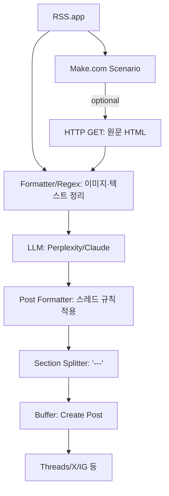

# Make AI Thread Uploader — Devlog **v2.0**
_2025-08-28 · Tags: AI-News-Pipeline, Make.com, RSS.app, Perplexity, Claude, Buffer_

---

## 🔥🔥🔥
**목표**: Apify/Notion 의존성을 제거하고 **경량화된 자동화 파이프라인** 구축.  
**설계**: RSS.app → (옵션) HTTP GET으로 HTML 확보 → 정규식 기반 이미지 추출 → LLM(Perplexity/Claude 요약·포맷팅) → `---` 분리(본문/댓글) → Buffer 예약 업로드.  
**성과**: 안정성↑, 속도↑, 유지보수성↑. 운영 중 복잡한 에러 케이스(빈 결과, 모듈 불일치, 불필요한 DB 동기화)가 사라짐.

---

## 왜 이렇게 개선했나(이유)
- **Apify 제거**:  
  - 빈 결과·차단·스키마 불일치 등으로 안정성 저하.  
  - 단순 HTML + Regex로 충분히 본문/이미지 확보 가능.  
- **Notion 제거**:  
  - 큐 관리보다 즉시 업로드가 주 목적.  
  - 상태 저장은 Make Data Store(`url_hash`, `posted_at`)로 대체.  
- **결과**: 전체 흐름이 단순해지고 운영 속도가 크게 향상.

---

## 무엇을 만들었나(단계: Planner → Executor → Reviewer)

### 1) Planner
- **요구사항**
  - RSS 아이템 → 한국어 스레드(150~280자, 존댓말, 불릿≥1, 질문 마무리)
  - 이미지 0~4장(중복/로고/광고 제외)
  - 댓글용 추가 설명은 `---` 아래 작성
- **KPI**
  - 성공률 > 95% (Buffer 업로드 기준)
  - 중복 0건(Data Store 해시)
  - 처리 지연 < 10초/건

### 2) Executor (모듈 사양)



#### RSS.app (Trigger)
- Fields: `title`, `url`, `published_at`, `summary?`
- **중복 방지**: Data Store에서 `url_hash` 조회 → 있으면 중단

#### (옵션) HTTP GET
- Input: `{{1.url}}`
- Output: `html_raw`  
- 목적: RSS summary 부족하거나 이미지 추출 실패 시 폴백

#### Image Parse (Regex + 휴리스틱)
- 소스: `summary` → `html_raw` → og:image
- 정규식:
```regex
]+src=["'](https?:\/\/[^"']+\.(?:jpg|jpeg|png|gif|webp))["']
```
- 필터: `logo|icon|sprite|badge|ads` 제외
- 결과: `images[]` (≤4), `thumbnail = images[0]`

#### LLM 요약·포맷
- Prompt: `prompts/thread_writer_v3.md`
- 입력: `title`, `url`, `published_at`, `clean_text`, `images[]`
- 출력: `post_text`, `comment_text`

#### Split
- `---` 기준 분리 → 본문/댓글

#### Buffer (Create Post)
- 본문: `post_text`
- 이미지: 1장 기본, 가능 채널만 최대 4장 시도 → 실패 시 1장 폴백
- 예약: `published_at` or 사용자 스케줄
- 댓글: Buffer 모듈 스레드 미지원 → 수동 운영

---

### 3) Reviewer (이슈/교훈)
| 이슈 | 해결 |
|---|---|
| Apify 빈 결과/차단 | 제거 → HTTP + Regex로 대체 |
| Notion 동기화 불필요 | Data Store로 대체 |
| Buffer 멀티이미지 제한 | 대표 1장 기본, ~~가능 시 4장~~ |
| 중복/길이 초과 | 해시 키·280자 컷 적용 |
| HTML 지연 로딩 | summary 우선, HTML 실패 시 폴백 |

---

## 체크리스트
- [ ] Data Store에 `url_hash` 정상 저장/조회
- [ ] 이미지 1장
- [ ] 본문 규칙(150~280자, 존댓말, 불릿≥1, 질문 마무리) 충족
- [ ] Buffer 응답

---

## 다음 액션
1. `prompts/thread_writer_v3.md` 커밋  
2. `regex/` 가이드 작성 (og:image 포함)  
3. Buffer API 직접 호출 실험 → 댓글 자동화 가능성 확인  
4. Data Store 지표화 (성공률, 실패율 로그)

---

## 커밋 로그(예시)
- `refactor: remove Apify/Notion, simplify pipeline`
- `feat(datastore): add url_hash duplicate check`
- `docs: add devlog v2.0 (lightweight pipeline)`

---

## 변경이력(Changelog)
- **2025-08-28 · v2.0** — Apify/Notion 제거, HTTP+Regex 기반 경량 파이프라인 확정.  
- **2025-08-27 · v1.0** — 초기 설계(Apify·Notion 포함), 운영 한계 파악.

