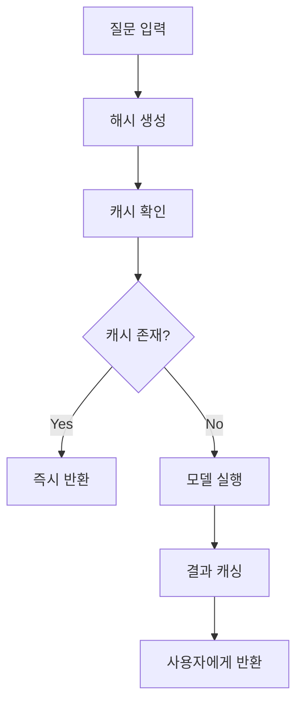

# 📌 AI 서비스 캐싱 전략 가이드

**결론**: AI 회사들은 운영 비용 절약을 위해 다양한 캐싱 전략을 적극 활용하고 있습니다.

---

## 📋 목차

- [1. 캐싱 방식 종류](#1-캐싱-방식-종류)
- [2. 캐싱 효과와 절약률](#2-캐싱-효과와-절약률)
- [3. 캐싱의 한계와 해결책](#3-캐싱의-한계와-해결책)
- [4. 실제 사례 분석](#4-실제-사례-분석)
- [5. 기술적 구현 방식](#5-기술적-구현-방식)

---

## 1. 캐싱 방식 종류

### 1-1. 응답 캐싱 (Response Caching)

**대상 질문**:
- "ChatGPT 사용법" 같은 반복 질문
- 수학 문제 계산 결과
- 자주 요청되는 언어 번역

**작동 방식**:
```
동일 질문 감지 → 저장된 답변 즉시 반환
```

### 1-2. 임베딩 캐싱

**개념**: 자주 나오는 개념이나 용어의 벡터 표현을 미리 저장

**효과**:
- 검색 시간 대폭 단축
- 의미 분석 속도 향상
- 관련 정보 빠른 연결

### 1-3. 모델 추론 캐싱

**내용**:
- 중간 계산 결과 저장
- GPU 연산 과정 재활용
- 복잡한 추론 단계 생략

---

## 2. 캐싱 효과와 절약률

| 비용 항목 | 절약률 | 구체적 효과 |
|-----------|--------|-------------|
| **계산 비용** | 70-90% | 재계산 불필요, GPU 사용량 감소 |
| **응답 시간** | 50-80% | 즉시 응답, 사용자 대기 시간 단축 |
| **전력 소비** | 60-85% | 서버 부하 감소, 친환경 효과 |
| **인프라 비용** | 40-70% | 서버 확장 필요성 감소 |

### 비용 절감 효과 예시

**OpenAI 추정 절약**:
- 일일 질문 수: 수억 건
- 캐싱으로 절약: 계산 비용의 약 80%
- 연간 절약 금액: 수십억 달러 추정

---

## 3. 캐싱의 한계와 해결책

### 3-1. 주요 한계점

**맥락 의존성 문제**:
- 같은 질문이라도 사용자별로 다른 답변 필요
- 이전 대화 맥락에 따라 의미 변화

**개인화 제약**:
- 개인 설정이나 선호도 반영 어려움
- 맞춤형 지침 적용 복잡성

**최신성 문제**:
- 실시간 정보 업데이트 지연
- 오래된 캐시 데이터 문제

### 3-2. 해결 방식

**하이브리드 캐싱**:
```
기본 답변(캐시) + 개인화 요소(실시간) = 최종 답변
```

**조건부 캐싱**:
- 맥락 변수 고려한 캐시 키 생성
- 사용자 프로필별 캐시 분리

**TTL(Time To Live) 설정**:
- 정보 유형별 만료 시간 차등 적용
- 뉴스: 1시간, 기술 문서: 1일, 기초 지식: 1주

---

## 4. 실제 사례 분석

### 4-1. 자주 캐싱되는 질문들

**기술 관련**:
- "Python 기초 문법 알려줘"
- "JavaScript 함수 사용법"
- "SQL 쿼리 작성 방법"

**일상 업무**:
- "이메일 작성법"
- "ChatGPT 사용법"
- "보고서 양식"

**언어 관련**:
- "Hello → 안녕하세요"
- "Thank you → 감사합니다"
- "기본 인사말 모음"

### 4-2. 캐싱 안 되는 질문들

**개인적 상황**:
- "내 프로젝트에 대한 조언"
- "우리 회사 상황 분석"
- "개인 고민 상담"

**실시간 정보**:
- "오늘 날씨"
- "최신 뉴스"
- "주식 시세"

**창작 요청**:
- "독창적인 소설 써줘"
- "새로운 아이디어 제안"
- "맞춤형 시 작성"

---

## 5. 기술적 구현 방식

### 5-1. 캐싱 프로세스



### 5-2. 캐시 키 생성 전략

**기본 방식**:
```
해시(질문 텍스트 + 모델 버전 + 언어)
```

**고급 방식**:
```
해시(
  정규화된 질문 + 
  사용자 설정 요약 + 
  모델 버전 + 
  컨텍스트 타입
)
```

### 5-3. 캐시 저장소 계층

| 계층 | 저장소 타입 | 용도 | 응답 속도 |
|------|-------------|------|-----------|
| **L1** | 메모리 (RAM) | 초고빈도 질문 | 1ms 이하 |
| **L2** | SSD 캐시 | 고빈도 질문 | 10ms 이하 |
| **L3** | 분산 캐시 | 중빈도 질문 | 100ms 이하 |

---

## 6. 캐싱 최적화 전략

### 6-1. 캐시 적중률 향상

**질문 정규화**:
- 띄어쓰기, 대소문자 통일
- 동의어 처리
- 문체 차이 흡수

**의미적 유사성 활용**:
```
"파이썬 기초" ≈ "Python 초보자 가이드" → 같은 캐시 사용
```

### 6-2. 캐시 무효화 전략

**시간 기반**:
- 기술 문서: 1주일
- 일반 지식: 1개월
- 기초 개념: 6개월

**이벤트 기반**:
- 모델 업데이트 시 전체 무효화
- 관련 데이터 변경 시 부분 무효화

---

## 💡 핵심 인사이트

### 비즈니스 관점
1. **운영비 절감**: 캐싱으로 70-90% 계산 비용 절약
2. **사용자 경험**: 응답 속도 50-80% 향상
3. **확장성**: 더 많은 사용자 수용 가능

### 기술적 관점
1. **효율성**: 중복 계산 제거로 리소스 최적화
2. **안정성**: 서버 부하 분산으로 시스템 안정성 향상
3. **지속가능성**: 전력 소비 감소로 친환경 효과

---

## 🎯 향후 전망

### 단기 발전 방향 (1-2년)
- **개인화 캐싱**: 사용자별 맞춤 캐시 전략
- **실시간 캐싱**: 동적 콘텐츠 빠른 캐싱
- **AI 기반 캐시 관리**: 캐시 전략 자동 최적화

### 장기 발전 방향 (3-5년)
- **예측적 캐싱**: 질문 예측해서 미리 캐싱
- **분산 캐싱**: 글로벌 캐시 네트워크 구축
- **멀티모달 캐싱**: 텍스트+이미지+음성 통합 캐싱

---

## 📚 참고 자료

- [Redis 캐싱 전략](https://redis.io/docs/manual/patterns/)
- [Google AI 인프라 논문](https://research.google/pubs/)
- [OpenAI 기술 블로그](https://openai.com/blog/)
- [캐싱 패턴 베스트 프랙티스](https://aws.amazon.com/caching/)

---

## 📄 라이선스

이 문서는 자유롭게 사용, 수정, 배포할 수 있습니다.
